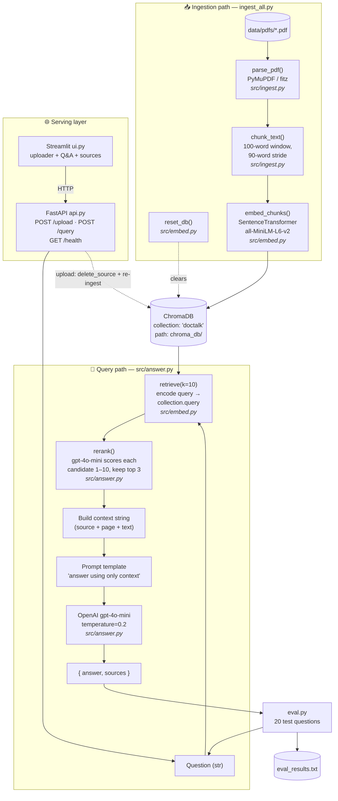

# DocTalk — RAG Pipeline Flow

A document-QA system: ingest PDFs → chunk → embed into ChromaDB → retrieve → answer with an LLM.

## Component reference

| Stage | Function | File | Key detail |
|-------|----------|------|------------|
| Parse | `parse_pdf(pdf_path)` | `src/ingest.py` | Extracts per-page `{text, page, source}` via PyMuPDF |
| Chunk | `chunk_text(pages)` | `src/ingest.py` | 100-word window, 90-word stride (10-word overlap) |
| Reset | `reset_db()` | `src/embed.py` | Drops & recreates the `doctalk` collection |
| Embed | `embed_chunks(chunks)` | `src/embed.py` | `all-MiniLM-L6-v2` (384-dim), stores id/doc/embedding/metadata |
| Store | ChromaDB `PersistentClient` | `src/embed.py` | Persisted at `chroma_db/` |
| Retrieve | `retrieve(question, k)` | `src/embed.py` | Top-k nearest chunks by vector similarity (k=10 when reranking) |
| Rerank | `rerank(question, chunks, top_k)` | `src/answer.py` | gpt-4o-mini scores each candidate 1–10 for answer-relevance, keeps top 3 |
| Delete source | `delete_source(source)` | `src/embed.py` | Removes one file's chunks so `/upload` can refresh it |
| Answer | `answer(question, use_rerank)` | `src/answer.py` | Grounded prompt → `gpt-4o-mini` → `{answer, sources}` |
| API | FastAPI app | `api.py` | `POST /upload`, `POST /query`, `GET /health` |
| UI | Streamlit app | `ui.py` | Talks to the API over HTTP (`API_URL` env var) |
| Orchestrate ingest | `ingest_all(data_dir)` | `ingest_all.py` | Resets DB, ingests every PDF in `data/pdfs/` |
| Evaluate | (script) | `eval.py` | Runs 20 questions, writes `eval_results.txt` |

> View this file in VS Code (with a Mermaid extension) or on GitHub to see the rendered diagram.
