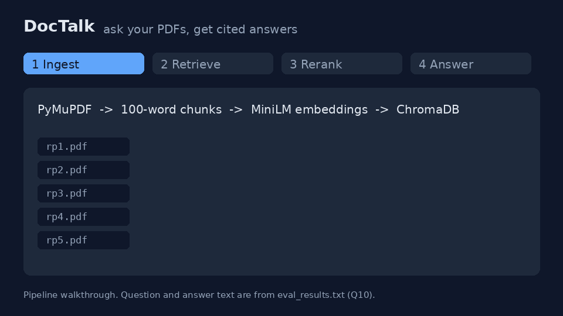

# DocTalk

Ask questions about your PDFs in plain English and get answers grounded in the actual documents, with source and page citations.

I built the whole RAG pipeline from scratch, no LangChain. Every layer (chunking, embedding, retrieval, reranking, prompting).

On my 20-question test set it gets 85% right (87.5% if partial answers count half), up from 70% before I added reranking. More on that below.



*A walkthrough of the pipeline. The question and answer come from my eval run (`eval_results.txt`).*

## How it works

```
                    ┌─────────────────────────────────────────────┐
                    │                  INGESTION                  │
  PDF ──► PyMuPDF ──► word-based chunking ──► all-MiniLM-L6-v2 ──► ChromaDB
                    │  (100-word window,       (384-dim vectors)  │ (persistent)
                    │   10-word overlap)                          │
                    └─────────────────────────────────────────────┘

                    ┌─────────────────────────────────────────────┐
                    │                    QUERY                    │
 question ──► embed ──► retrieve top 10 ──► LLM rerank ──► top 3 ──► gpt-4o-mini ──► answer
                    │    (ChromaDB)       (gpt-4o-mini,            │   (grounded      + sources
                    │                      1-10 scoring)           │    prompt)
                    └─────────────────────────────────────────────┘
```

Stack: Python, PyMuPDF, sentence-transformers, ChromaDB, OpenAI gpt-4o-mini, FastAPI, Streamlit.

## Design decisions

**No LangChain.** I wanted to understand every layer, not glue framework calls together. This paid off multiple times when debugging, for example the silent chunk ID collision below.

**Word-based windowed chunking** (100-word window, 90-word stride) instead of character-based. Character chunks kept cutting words in half at the boundaries, which polluted both the embeddings and the displayed sources.

**Namespaced chunk IDs** like `rp2.pdf_chunk_14`. ChromaDB's `add()` silently drops any ID that already exists, no error, no warning. With per-file IDs like `chunk_0`, three of my five papers ended up with zero chunks in the database while the logs looked completely fine. Hardest bug in the project.

**LLM reranking.** Plain embedding similarity kept retrieving bibliography chunks, since a reference list mentions all the right keywords without answering anything. So retrieval now pulls 10 candidates and a second gpt-4o-mini pass scores each one on whether it actually answers the question, keeping the top 3. This took eval accuracy from 70% to 85%.

**Grounded prompting.** The answer prompt requires full-sentence answers with source and page citations, and explicitly allows "I don't have enough information" instead of making something up.

**Session-scoped knowledge base.** Each browser session only sees the PDFs it uploaded, enforced with a ChromaDB metadata filter rather than separate collections. Same pattern multi-tenant RAG systems use in production.

## Run it locally

```bash
git clone https://github.com/ibr2309/doctalk.git
cd doctalk
python -m venv venv
venv\Scripts\activate        # Windows (source venv/bin/activate on Linux/Mac)
pip install -r requirements.txt
cp .env.example .env         # then put your OpenAI key in .env

python ingest_all.py         # build the vector DB from data/pdfs/
uvicorn api:app --reload     # backend on :8000
streamlit run ui.py          # UI on :8501 (second terminal)
```

UI at http://localhost:8501, API docs at http://localhost:8000/docs.

## API

| Method | Endpoint   | Body                                                             | Returns                  |
|--------|------------|------------------------------------------------------------------|--------------------------|
| POST   | `/upload`  | multipart PDF file                                               | filename, chunks added   |
| POST   | `/query`   | `{"question": "...", "use_rerank": true, "source": "file.pdf"?}` | answer + source chunks   |
| GET    | `/sources` | none                                                             | documents in the KB      |
| GET    | `/health`  | none                                                             | `{"status": "ok"}`       |

`source` restricts retrieval to one document (or a list of them) using a ChromaDB metadata filter. Without it, questions search everything.

## Evaluation

I benchmarked on 5 Amii/UAlberta research papers with 20 questions covering per-paper facts, cross-paper questions, meta questions, summarization, and a couple of trick questions. Answers were graded pass/partial/fail against the source texts (`eval.py` writes the transcript to `eval_results.txt`).

| Run | Setup | Strict pass | Weighted (partial = 0.5) |
|-----|-------|-------------|--------------------------|
| 1 | original prompt, k=5 | 15/20 (75%) | 82.5% |
| 2 | rewritten grounded prompt, k=5 | 14/20 (70%) | 80% |
| 3 | added LLM reranking (k=10 to top 3) plus prompt fixes | **17/20 (85%)** | **87.5%** |

Every failure the eval caught was traced to a root cause and fixed (the grounded prompt, namespaced chunk IDs and LLM reranking all came from this loop). Two failures remain: bibliography pollution on "which papers discuss X" questions (the answer cites papers listed inside a bibliography instead of the files in the collection), and misreading a capstone report as a journal paper. A third answer is graded partial because it describes real results but misses the paper's headline contribution.

## The eval corpus

1. DMMGAN, diverse human motion prediction with GANs
2. Multi-label tweet emotion classification
3. Time-discretization in reinforcement learning (De Asis and Sutton)
4. Convergence of average-reward RVI Q-learning (Wan, Yu and Sutton)
5. AI/ML cybersecurity for autonomous vehicles (MSc capstone report)

## Tests

```bash
pip install pytest pymupdf openai python-dotenv
pytest -q
```

There are a few unit tests for the chunker and the reranker. The embedding model, ChromaDB and OpenAI are faked, so they run without an API key. GitHub runs them on every push too.

## Limitations

This is a project I built to learn how RAG works, not a finished product. Things to know:

- The eval is small. It's 20 questions on 5 papers, and I wrote and graded them myself, so one question is worth 5 points. 85% tells you how it did on these papers, not how it will do on anything.
- Almost everything I tested on is ML research papers. I haven't tried contracts, manuals or slides.
- It only reads PDFs with real text. There's no OCR, so scanned documents come out empty, and Word or HTML files aren't supported.
- Chunking is just 100 words at a time. It doesn't know about headings, sentences or tables, so tables and multi-column pages can get scrambled.
- Reranking fixed most of the bibliography problem, but "which papers discuss X" questions can still pull in reference lists.
- Reranking costs one extra OpenAI call per candidate chunk (10 per question), so answers are slower and a bit pricier.
- No login, rate limiting or upload size limit. It's meant to run on your own machine.

## What I'd do next

- Add more questions, and some non-paper documents, to the eval.
- Try chunking by section or sentence and compare it against the current version using the same eval.
- Try hybrid search (keywords plus embeddings), and a cheaper reranker than one LLM call per chunk.
- Add OCR for scanned PDFs, and test questions the documents can't answer to see if it says "I don't know".

## License

MIT
